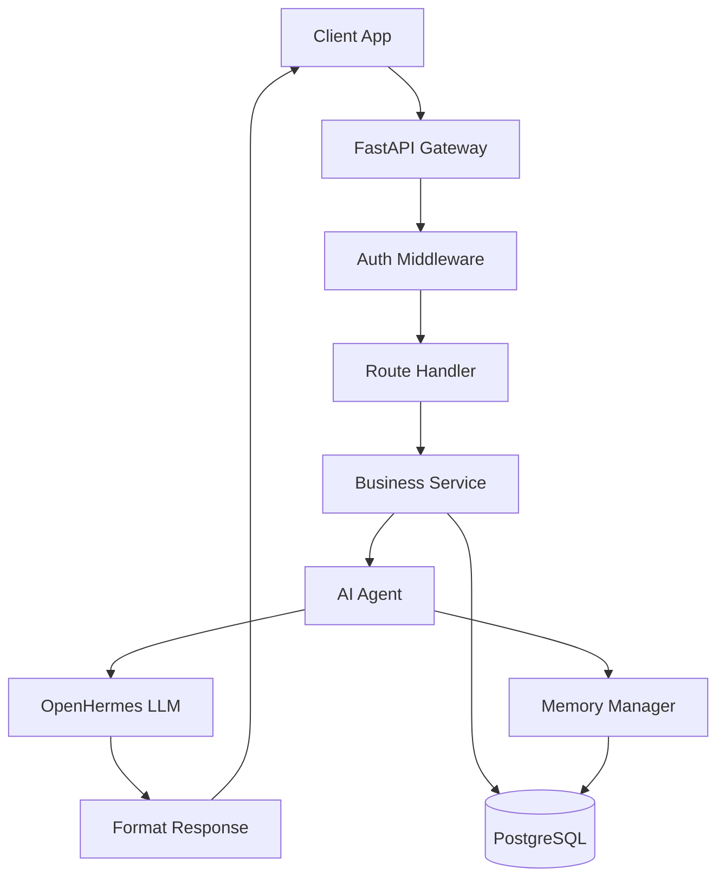

# Sarah AI Backend - Technical Architecture

## System Overview

Sarah AI is a sophisticated conversational AI system that provides personalized, context-aware interactions through multiple AI personalities. The system is built on a modern async Python stack with FastAPI, PostgreSQL, and the OpenHermes 2.5 Mistral 7B language model.

## Core Architecture Principles

### 1. **Personality-Driven Design**
The system dynamically selects AI personalities based on user gender detection:
- **Sarah**: Warm, empathetic female persona for male users
- **Xhash**: Confident, charming male persona for female users  
- **Neutral**: Professional, balanced persona when gender is unknown

### 2. **Relationship Evolution System**
Tracks and evolves relationships through 6 stages:
```
Stranger → Acquaintance → Friend → Close Friend → Romantic Interest → Partner
```
Each stage unlocks different conversation styles, topics, and emotional depth.

### 3. **Memory & Context Management**
- **Short-term**: Active conversation context (last 10 messages)
- **Long-term**: User facts, preferences, conversation history
- **Episodic**: Memorable moments and emotional peaks
- **Semantic**: Extracted entities and relationships

## Technical Stack

### Backend Framework
- **FastAPI**: High-performance async web framework
- **Uvicorn**: ASGI server with hot-reload support
- **Pydantic**: Data validation and settings management

### AI/ML Components
- **OpenHermes 2.5 Mistral 7B**: Core language model (4-bit quantized)
- **llama-cpp-python**: Efficient CPU inference
- **Transformers**: Tokenization and text processing

### Database
- **PostgreSQL 13+**: Primary data store
- **asyncpg**: High-performance async PostgreSQL driver
- **Connection Pooling**: 5-20 concurrent connections

### Authentication & Security
- **JWT**: Stateless authentication tokens
- **bcrypt**: Password hashing
- **CORS**: Configured for frontend integration

## Data Flow Architecture



## Key Components

### 1. API Gateway Layer (`app/api/`)
- Request validation
- Authentication/authorization
- Rate limiting
- CORS handling
- Response formatting

### 2. Service Layer (`app/services/`)
Orchestrates business logic:
- **AuthService**: User registration, login, token management
- **ChatService**: Message processing, conversation management
- **MemoryService**: User memory extraction and retrieval
- **LLMService**: Model loading and inference

### 3. Agent System (`app/agents/`)
Personality and behavior management:
- **BaseAgent**: Abstract interface for all agents
- **PersonalityAgents**: Sarah, Xhash, Neutral implementations
- **IntentRouter**: Routes messages to appropriate handlers
- **MemoryManager**: Manages conversation context

### 4. Database Layer (`app/database/`)
Data persistence and retrieval:
- **Repositories**: Data access patterns
- **Migrations**: Schema version management
- **Connection Pool**: Efficient connection reuse

## Database Schema

### Core Tables

#### users
```sql
- id: UUID (PK)
- email: VARCHAR(255) UNIQUE
- username: VARCHAR(100) UNIQUE  
- password_hash: VARCHAR(255)
- is_active: BOOLEAN
- created_at: TIMESTAMP
```

#### user_profiles
```sql
- user_id: UUID (FK → users.id)
- name: VARCHAR(100)
- gender: VARCHAR(20)
- age: INTEGER
- location: VARCHAR(255)
- preferences: JSONB
- relationship_score: INTEGER
- updated_at: TIMESTAMP
```

#### conversations
```sql
- id: UUID (PK)
- user_id: UUID (FK → users.id)
- title: VARCHAR(255)
- personality: VARCHAR(50)
- started_at: TIMESTAMP
- last_message_at: TIMESTAMP
- is_active: BOOLEAN
```

#### messages
```sql
- id: UUID (PK)
- conversation_id: UUID (FK → conversations.id)
- role: VARCHAR(20) -- 'user' or 'assistant'
- content: TEXT
- personality: VARCHAR(50)
- tokens_used: INTEGER
- created_at: TIMESTAMP
```

#### user_facts
```sql
- id: UUID (PK)
- user_id: UUID (FK → users.id)
- fact_type: VARCHAR(50)
- fact_value: TEXT
- confidence: FLOAT
- source: VARCHAR(50)
- extracted_at: TIMESTAMP
```

## Performance Optimizations

### 1. Model Inference
- **CPU Affinity**: Pins model to cores 4-7
- **Process Priority**: Runs at highest priority (-20)
- **Batch Processing**: 256 token batches
- **Context Window**: Limited to 1024 tokens
- **Quantization**: 4-bit model reduces memory usage

### 2. Database
- **Connection Pooling**: Reuses connections
- **Prepared Statements**: Prevents SQL injection
- **Indexes**: On frequently queried columns
- **JSONB**: For flexible schema fields

### 3. Caching Strategy
- **In-Memory**: Active user sessions
- **Model Cache**: Loaded model persists
- **Response Cache**: Common queries

## Security Measures

### Authentication
- JWT tokens with 24-hour expiration
- Refresh token rotation
- Session invalidation on logout

### Data Protection
- Password hashing with bcrypt (12 rounds)
- Parameterized SQL queries
- Input sanitization
- Rate limiting per user

### API Security
- CORS with whitelist
- HTTPS enforcement (production)
- Request size limits
- Timeout policies

## Deployment Architecture

### Development
```bash
uvicorn app.main:app --reload --host 0.0.0.0 --port 8000
```

### Production
```bash
# Optimal configuration for VPS
taskset -c 4-7 nice -n -20 uvicorn app.main:app \
  --host 0.0.0.0 \
  --port 8000 \
  --workers 1 \
  --loop uvloop \
  --no-access-log
```

### System Requirements
- **CPU**: 8+ cores recommended
- **RAM**: 8GB minimum (4GB for model)
- **Storage**: 20GB for model and data
- **OS**: Linux (Ubuntu 20.04+ preferred)

## Monitoring & Logging

### Health Checks
- `/health` - System status
- Database connectivity
- Model loading status
- Active user count

### Metrics
- Response times
- Token generation speed
- Memory usage
- Active connections

### Logging
- Structured JSON logs
- Log levels: DEBUG, INFO, WARNING, ERROR
- Rotating file handler
- Centralized error tracking

## Scaling Considerations

### Horizontal Scaling
- Stateless design enables multiple instances
- Load balancer for request distribution
- Shared PostgreSQL database
- Redis for session management (future)

### Vertical Scaling
- More CPU cores improve inference speed
- Additional RAM for larger context windows
- SSD storage for faster model loading

## Future Enhancements

### Planned Features
1. **Voice Integration**: Speech-to-text and text-to-speech
2. **Multi-modal**: Image understanding and generation
3. **Advanced Memory**: Graph-based relationship mapping
4. **Emotion Detection**: Sentiment analysis and mood tracking
5. **Multi-language**: Support for non-English conversations

### Technical Improvements
1. **GPU Acceleration**: CUDA support for faster inference
2. **Microservices**: Separate services for different components
3. **Event Sourcing**: Complete conversation history replay
4. **GraphQL API**: Flexible query interface
5. **WebSocket**: Real-time bidirectional communication

## Development Workflow

### Local Development
1. Clone repository
2. Set up virtual environment
3. Install dependencies
4. Configure .env file
5. Run database migrations
6. Start development server

### Testing Strategy
- Unit tests for services
- Integration tests for API endpoints
- Load testing for performance
- Conversation flow testing

### CI/CD Pipeline
- GitHub Actions for automated testing
- Docker containerization
- Automated deployment to VPS
- Blue-green deployment strategy

## Troubleshooting Guide

### Common Issues

#### Port Already in Use
```bash
pkill -f "python.*main"
pkill -f uvicorn
```

#### Model Loading Failures
- Verify model file exists and is readable
- Check available RAM (minimum 4GB free)
- Ensure correct model path in .env

#### Database Connection Issues
- Verify PostgreSQL is running
- Check credentials in .env
- Ensure database exists
- Review firewall rules

#### Slow Response Times
- Check CPU usage and throttling
- Verify model is using correct cores
- Review context window size
- Monitor database query performance

## Contributing Guidelines

### Code Style
- Black for formatting
- Type hints for all functions
- Docstrings for modules and classes
- Async/await for I/O operations

### Pull Request Process
1. Create feature branch
2. Write tests for new features
3. Update documentation
4. Submit PR with description
5. Pass CI checks
6. Code review approval

### Commit Convention
```
type(scope): description

[optional body]

[optional footer]
```

Types: feat, fix, docs, style, refactor, test, chore